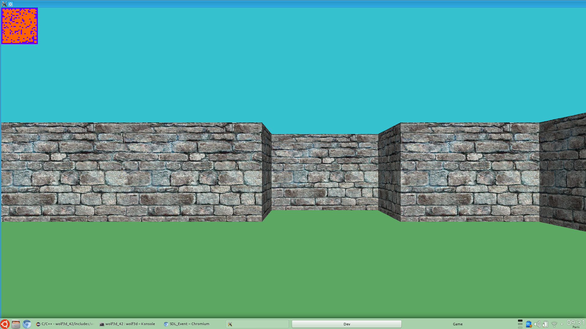

# wolf3d_42

- Important:
  - :bangbang: FUITES MEMOIRE :bangbang: :bomb: :gun: :bangbang:
  - [x] floor texture
  - [x] ceil texture
  - [ ] skybox
  - [ ] sprite 360
  - [x] simplifier raycasting
  - [x] FIXME: Premiere et derniere ligne de pixel (et colone pour les sprite)
  - [ ] gestion propre des couleurs (revoir t_color)
  - [x] nouveau format map (mur, plafont, sol, sprite)
  
- Contenue:
  - [x] sample map
  - [ ] plein de maps
  - [ ] multimode (wolfenstein, 42stein, ...)
  - [ ] clone wolfenstein 3d http://www.spriters-resource.com/pc_computer/wolfenstein3d/
  - [x] create json to binaire (lua || python)
  - [x] dev map loader

- Multimode:
  - [ ] wolfenstein 3D ([map](http://www.playstationtrophies.org/forum/wolfenstein-3d/20241-level-key-locations-maps.html))
  - [ ] 42stein
  - [ ] Pacman3D ([map](http://i190.photobucket.com/albums/z120/ccrv/img/pacman.jpg))
  - [ ] The Binding of Isaac
  
- Input:
  - [x] mode souris + clavier
  - [x] mode full clavier
  - [x] mode gamepad

- Gameplay:
  - [ ] 360 no-scope
  - [x] Sprint
  - [ ] Health Point
  - [ ] Stamina
  - [ ] allonger accroupis
  - [ ] sauter
  - [x] hitbox
  - [ ] glissement
  - [ ] armes [url](http://forum.zdoom.org/viewtopic.php?f=37&t=33996)
  - [ ] npc

- Compatibilite:
  - [x] compatibiliter MacOS
  - [x] compatibiliter Linux
  - [ ] compatibiliter android ([gcc](https://play.google.com/store/apps/details?id=com.n0n3m4.gcc4droid), [SDL](https://play.google.com/store/apps/details?id=com.n0n3m4.droidsdl))
  - [ ] compatibiliter Windows (pour l'E2)

- Bonus:
  - [ ] sfx
  - [x] music
  - [ ] gui
  - [ ] menu
  - [ ] sprites 360
  - [ ] animations sprites
  - [ ] animations textures
  - [ ] mirroirs

Bonus dur:
  - [ ] portal
  - [ ] mur non perpendiculaire
  - [ ] split-sreen
  - [ ] oculust rift
  - [ ] mipmap ([exemple](http://www.fevrierdorian.com/blog/post/2009/12/24/Les-maps-mental-ray-(part-2.1)%3A-Le-debug))
  - [ ] multijoueur

