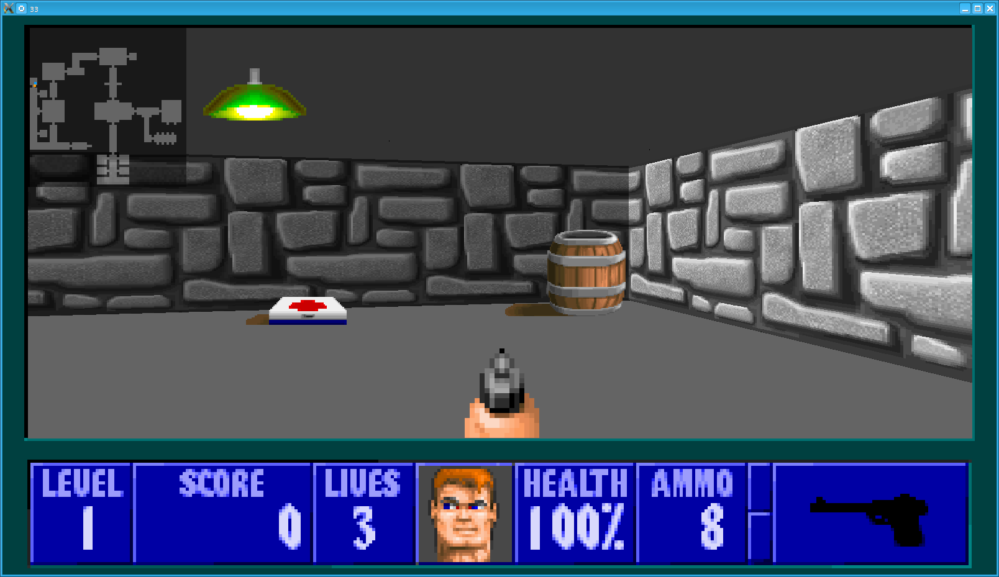
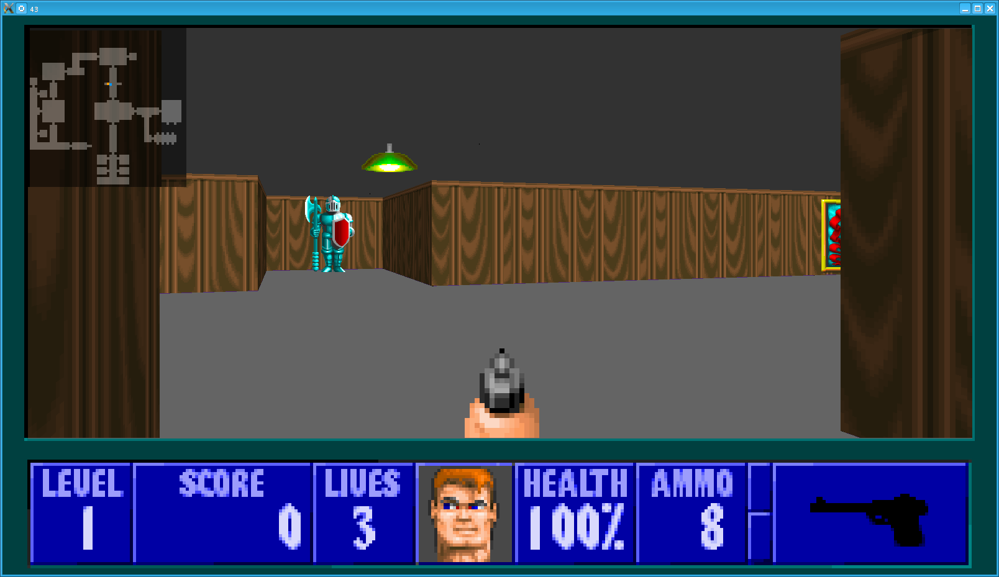
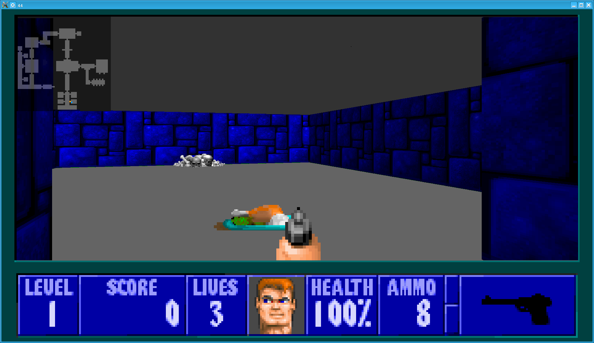

# wolf3d_42 :suspect:

- Fonctionnalité
  - 60 FPS en 1600x900
  - Sprites et Textures en 512x512
  - Textures plafond, sol, mur
  - Skybox
  - Sprite 360°
  - Editeur de map
  - Sons et musiques
  - Jouable full clavier, clavier + souris, manette
  - 

- Compatibilite:
  - compatibiliter MacOS
  - compatibiliter Linux
  - compatibiliter Android (fonctionne mais pas jouable)
  - compatibiliter Windows (pas de windows pour tester)

- WIP:
  - Multijoueur (Server LuaJIT socket TCP + UDP)

